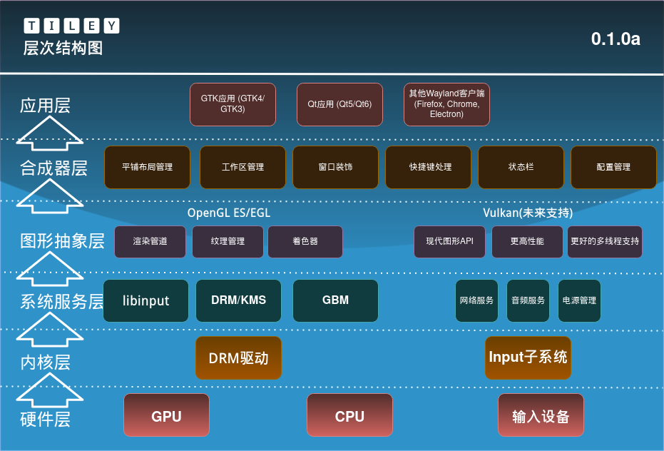

<center>

# Tiley: 高度可自定义平铺式桌面管理器

</center>


欢迎使用 **tiley**！这是一个基于 **Wayland** 和 **Louvre** 开发的桌面管理器。我们的目标是创建一个高效、可定制且用户友好的 Wayland 合成器。



## 开发环境搭建

本指南将帮助你快速在你的机器上设置 `tiley` 的开发环境。

### 1. 克隆仓库

首先，克隆 `tiley` 的主仓库, 并初始化 `Louvre` 等子模块:

```bash
git clone https://github.com/creamIcec/tiley.git
cd tiley
git submodule update --init --recursive
```

### 2. 安装依赖

`tiley` 依赖于 `Louvre` 及其核心后端 `SRM`，以及相关的 `Wayland` 生态系统库。

**核心依赖(以`meson`语句格式表示)**

```meson
wayland_server_dep  = dependency('wayland-server', version: '>= 1.20.0')
gl_dep              = dependency('gl', version: '>= 1.2')
egl_dep             = dependency('egl', version : '>=1.5')
glesv2_dep          = dependency('glesv2', version: '>= 3.2')
udev_dep            = dependency('libudev', version: '>= 249')
xcursor_dep         = dependency('xcursor', version: '>= 1.2.0')
xkbcommon_dep       = dependency('xkbcommon', version: '>= 1.4.0')
pixman_dep          = dependency('pixman-1', version: '>= 0.40.0')
drm_dep             = dependency('libdrm', version: '>= 2.4.113')
input_dep           = dependency('libinput', version: '>= 1.20.0')
libseat_dep         = dependency('libseat', version: '>= 0.6.4')
srm_dep             = dependency('SRM', version : '>=0.13.0')
pthread_dep         = cpp.find_library('pthread')
dl_dep              = cpp.find_library('dl')
```

**可选依赖(随项目开发可能发生改变)**

- **`zwp_linux_dmabuf_v1`**: 为了支持更广泛的现代应用（如 GNOME 系应用），建议启用 DMA-BUF 支持。这通常不需要额外安装，依赖于核心库 `libdrm` 和 `mesa`。
- **`wayland-protocols`**: 提供了一系列标准的 Wayland 扩展协议，增强兼容性。

**X11 兼容依赖**

`tiley` 目标是尽可能兼容 `X11` 应用程序, 因此需要安装下面的依赖:

- **xwayland**: 提供 X11 兼容层 (编译需要, 运行时可选)
- **libxcb**: X 协议 C binding
- **libxcb-render-util**: `libxcb`的渲染工具
- **libxcb-wm**: `libxcb`的窗口管理器扩展
- **libxcb-errors**: `libxcb`的错误报告库, 用于更加易读

**安装示例**

**Arch Linux(或基于 Arch 的发行版)**

如果你使用 Arch Linux, 可以通过 `pacman` 安装相关依赖。`Louvre` 和 `SRM` 将作为子模块被构建，无需通过包管理器安装。

```bash
sudo pacman -S --needed meson wayland wayland-protocols libdrm libinput libxkbcommon pixman systemd libseat libxcursor mesa libglvnd
```

下面是 `X11` 兼容部分:

```bash
sudo pacman -S xorg-xwayland libxcb libxcb-render-util libxcb-wm libxcb-errors
```

**其他发行版(Debian/Ubuntu/Fedora/SUSE 等)**

请根据对应的包管理器安装与上述列表对应的包 (某些包可能需要添加 `-dev` 或者 `-devel` 的后缀)。一个高效的策略是，在首次编译时，若 `meson` 报告缺少某个依赖，则根据提示安装它。

### 3. 构建项目

`tiley` 使用 **Meson** 作为构建系统。首先进入项目根目录, 然后:

1.  配置构建目录:

    ```bash
    meson setup build/
    ```

    为了方便开发，`meson.build` 文件被配置为优先使用子模块。它会自动寻找 `subprojects/Louvre` 和 `subprojects/SRM` 中的代码并构建它们，确保你总是在使用与 `tiley` 兼容的框架版本。

2.  编译项目:

    ```bash
    meson compile -C build/
    ```

### 4. 运行

编译成功后，你就可以运行 `tiley` 啦！

`tiley` 是一个 Wayland 合成器，它可以通过两种主要方式运行：

1.  在现有的桌面环境（如 X11 或另一个 Wayland 合成器）中以一个窗口的形式运行。
2.  切换到 TTY (通常通过 `Ctrl+Alt+F3` 等)，登录后直接运行，此时 `tiley` 将接管整个屏幕。

无论哪种方式，启动指令都是：

```bash
./build/tiley
```

### 5. 常见问题

- **Q: (运行时) 提示找不到 `.so` 运行库, 比如 `libSRM.so` 或 `libLouvre.so`，怎么办?**

  A: 这说明你的系统动态链接器找不到我们刚刚从子模块编译出的库。因为它们被放在了 `build/` 目录中，而不是标准的系统路径（如 `/usr/lib`）。解决方法是临时将这个路径添加到环境变量中：

  ```bash
  # SRM 是 Louvre 的核心运行时库
  export LD_LIBRARY_PATH=$PWD/build/subprojects/SRM:$LD_LIBRARY_PATH
  ./build/tiley
  ```

  如果不想每次都手动设置，可以考虑在开发时将其加入到你的 `.bashrc` 或 `.zshrc` 中。

- **Q: (开发时) 出现 `undefined reference to Louvre::LCompositor::...` 等链接错误, 怎么办?**

  A: 这个问题通常不会在 `Louvre` 项目中出现，因为 `Louvre` 本身就是用 C++ 编写的，你的项目 `tiley` 也是 C++。这意味着编译器和链接器对符号（函数名、类名等）的处理方式是一致的，不会出现 C/C++ 混合编程时的“符号粉碎 (Name Mangling)”问题。

  如果你遇到了这类链接错误，原因很可能是：

  1.  **Meson 配置问题**：检查你的 `meson.build` 文件，确保你正确地将 `Louvre` 和 `SRM` 的依赖添加到了你的 `tiley` 可执行文件的 `dependencies` 列表中。
      ```meson
      # 示例
      executable('tiley',
          'src/main.cpp',
          # ... 其他源文件
          dependencies: [louvre_dep, srm_dep, /* 其他依赖 */],
          install: true)
      ```
  2.  **子模块构建失败**：`meson compile` 可能在构建 `Louvre` 或 `SRM` 子模块时就已经失败了，但你没有注意到。请仔细检查编译日志，确保子模块被成功编译成了 `.so` 或 `.a` 文件。

- **Q: (开发时) `Louvre` 或 `SRM` 子模块构建失败了?**

  A: 如果 `meson compile` 在构建子模块时失败，这几乎总是由于核心依赖没有被满足。请仔细阅读 `build/meson-logs/meson-log.txt` 中关于 `Louvre` 或 `SRM` 子项目构建部分的错误信息。日志会明确告诉你缺少哪个库（比如 `libseat-devel` 或 `wayland-protocols`），根据提示用你的包管理器安装它即可。

- **Q: (运行时) 我打开某些应用（如 GNOME 系应用）时，`tiley` 崩溃或应用窗口不显示，日志里有 `Unknown buffer type` 或 `Failed to convert buffer to OpenGL texture` 的错误，这是为什么？**

  A: 这是个非常经典的问题！它意味着你的合成器只支持基础的 `wl_shm` 共享内存缓冲区，而客户端应用正在尝试使用更高效的 `DMA-BUF` 进行硬件缓冲区共享。`Louvre` 默认不会启用所有扩展协议，需要你手动开启。

  **解决方法**：在你的主服务类（例如 `TileyServer.cpp`）的初始化代码中，实例化 `LDMABufProtocol`。

  ```cpp
  // 在你的 TileyServer.h 或类似的地方
  #include <Louvre/protocols/LinuxDMABuf/LDMABufProtocol.h>
  #include <memory>

  class TileyServer {
      // ...
  private:
      std::unique_ptr<Louvre::Protocols::LinuxDMABuf::LDMABufProtocol> m_dmaBufProtocol;
  };

  // 在你的 TileyServer.cpp 的构造函数或初始化函数里
  TileyServer::TileyServer() {
      // ... 其他初始化 ...

      // 启用 zwp_linux_dmabuf_v1 协议支持
      m_dmaBufProtocol = std::make_unique<Louvre::Protocols::LinuxDMABuf::LDMABufProtocol>();
  }
  ```

  重新编译后，你的合成器就学会了如何处理 `DMA-BUF`，从而能够兼容更多现代应用程序。

- **Q: 我该如何调试 `tiley`？**

  A: `Louvre` 和 Wayland 生态提供了强大的调试工具：

  1.  **Louvre 日志**：`Louvre` 内置了 `LLog` 日志系统。你可以在代码中通过 `LLog::debug("My message: %d", my_var);` 等方式添加详细的调试信息。
  2.  **WAYLAND_DEBUG**：这是 Wayland 的终极调试工具。通过设置这个环境变量，你可以看到客户端和你的合成器之间所有协议层面的通信细节。
      ```bash
      WAYLAND_DEBUG=1 ./build/tiley
      ```
      这对于诊断协议实现问题、客户端兼容性问题等非常有帮助。

---

我们希望这份指南能让你在 `tiley` 的开发之旅中一帆风顺。如果你发现了任何问题，或者有任何建议，欢迎随时提出 Issue 或 Pull Request！

**Happy Hacking!**

这个项目现在是**全国大学生计算机系统能力大赛(2025) 国赛**参赛作品, 因此代码使用协议暂时未定, 但如果之后开源, 为了确保一直保持开源(包括衍生项目), 项目遵循 LPGLv2.1 协议 ❤️。
