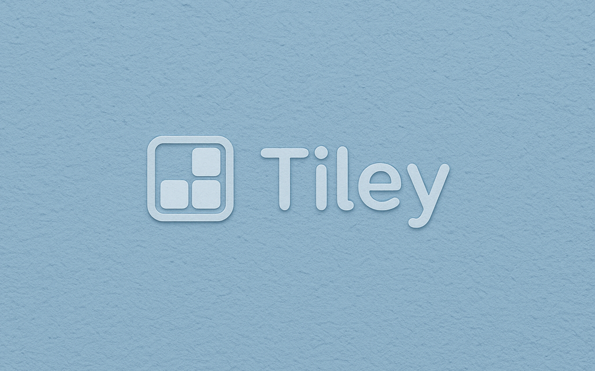

<center>

# Tiley: 高度可自定义平铺式桌面管理器

</center>



欢迎使用 **tiley**！这是一个基于 **Wayland** 和 **wlroots** 开发的桌面管理器。我们的目标是创建一个高效、可定制且用户友好的 Wayland 复合器。


---

## 开发环境搭建

本指南将帮助你快速在你的机器上设置`tiley`的开发环境。

### 1. 克隆仓库

首先，克隆`tiley`的主仓库, 并初始化`wlroots`子模块:

```bash
git clone [https://github.com/creamIcec/tiley.git](https://github.com/creamIcec/tiley.git)
cd tiley
git submodule update --init --recursive
```

### 2. 安装依赖

`tiley`依赖于`wlroots`及其相关的`Wayland`生态系统库。
这里如果你选择自己构建`wlroots`, 那你需要下面这些`wlroots`的依赖:

**核心依赖**

- **Meson**: 构建系统
- **Wayland**: Wayland 协议库
- **Wayland Protocols**: Wayland 协议头文件
- **libdrm**: 直接渲染管理器库
- **libinput**: 输入设备处理库
- **xkbcommon**: 键盘布局库
- **pixman**: 像素操作库
- **udev**: 设备管理 (用于用户 session 中)
- **libseat**: 权限管理 (用于用户 session 中)
- **libdisplay-info**: 显示器信息库 (用于 DRM 后端)
- **libliftoff**: DRM 复合器层管理库 (用于 DRM 后端)
- **hwdata**: 硬件数据 (用于 DRM 后端)

**可选依赖(随项目开发可能发生改变)**

- **EGL 和 GLESv2**: 如果最后决定使用 GLES2 渲染器的话;
- **Vulkan loader, headers 和 glslang**: 如果最后决定使用 vulkan 渲染器的话;
- **GBM**: 如果最后决定使用 GBM 分配器的话;

**X11 兼容依赖**

`tiley`目标是尽可能兼容`X11`应用程序, 因此需要安装下面的依赖:

- **xwayland**: 提供 X11 兼容层 (编译需要, 运行时可选)
- **libxcb**: X 协议 C binding
- **libxcb-render-util**: `libxcb`的渲染工具
- **libxcb-wm**: `libxcb`的窗口管理器扩展
- **libxcb-errors**: `libxcb`的错误报告库, 用于更加易读

**安装示例**

**Arch Linux(或基于 Arch 的发行版)**

如果你使用 Arch Linux, 通过`pacman`安装相关依赖, 具体参考`wlroots`的`README`部分的 Building 部分, 这里直接给出指令:

```bash

sudo pacman -S --needed meson wayland wayland-protocols libdrm libinput libxkbcommon pixman systemd libseat hwdata libdisplay-info libliftoff

```

下面是`X11`兼容部分:

```bash
sudo pacman -S xorg-xwayland libxcb libxcb-render-util libxcb-wm libxcb-errors
```

下面是渲染器可选安装部分(随项目开发可能发生变化):

```bash
sudo pacman -S mesa libglvnd libgbm vulkan-headers glslang vulkan-icd-loader
```

**其他发行版(Debian/Ubuntu/Fedora/SUSE 等)**

请根据对应的包管理器安装对应的包(某些包可能需要添加`-dev`或者`-devel`的后缀)。
一种高效的方法是, 在编译`wlroots`时, 若报告缺少某个依赖，则安装之。

### 3. 构建项目

`tiley`使用**Meson**作为构建系统。首先进入项目根目录, 然后:

1. 配置构建目录:

```bash
meson setup build/
```

为了同时方便开发者和用户两种角色, 这里使用的`meson.build`稍微有些复杂。Meson 会尝试先查找系统中的`wlroots`依赖，如果找到了，就会使用系统提供的版本。如果找不到，就会自动切换成`subprojects/wlroots`中的代码并构建之。

2. 编译项目:

```bash

meson compile -C build/

```

### 4. 运行

编译成功后，你可以运行`tiley`啦。

一些重要的提示: `tiley`是一个 Wayland 合成器, 需要在 Wayland 的环境下面运行。我们的目标是可以两种方式运行, 类似`tinywl`那样的行为:

1. 在桌面环境下以虚拟显示的形式运行,

2. 进入 TTY 中再运行(可以按 Ctrl+Alt+Fx 键切换到文本模式, Fx 指的是 F1, F2, F3 等, 因系统而异)。

不管如何, 指令都是:

```bash

./build/tiley

```

### 5. 常见问题

- Q: (运行时/开发时)我在运行`tiley`时提示找不到`.so`运行库, 怎么办?

A: 这说明你的系统标准文件夹(`/usr/bin/lib`等)和`tiley`存放的文件夹下等位置都没有需要的运行库。这个可能会发生在你使用的是从源代码自行编译的`wlroots`的情况下。这种情况下, 请先手动指定运行库到环境变量中, 或者将`.so`文件移动到标准文件夹或者运行文件夹下。

首先排除`subprojects`中的`wlroots`编译输出位置不对的问题, 有可能输出位置在`build/subprojects/wlroots`中, 此时设置:

```bash

export LD_LIBRARY_PATH=$PWD/build/subprojects/wlroots:$LD_LIBRARY_PATH
./build/tiley

```

如果不是在这个位置, 其他位置也同理。如果不想自己构建的话, 最简单的方法是用包管理器安装一个`wlroots`, 此时一定放在标准文件夹中。

- Q: (开发时)尝试构建项目时, 出现`undefined reference to...`的链接错误, 怎么办?

A: 先给出解决方法: 在设计到引用 C 头文件的地方添加 extern "C"预处理语句:

```C++

extern "C" {
    #include <wlr/util/log.h>
}

```

解释一下原因吧。因为`wlroots`使用`C`语言编写, 而我们的`tiley`由`C++`编写。虽然`C++`从设计上与`C`完全兼容, 不过这种兼容更多体现在功能上, 编译机制上可能有差异。在这里其中的一个原因是, C++编译器会对各种名称(函数，变量，类)等进行**Mangling**, 而 C 编译器不会。这就导致了二者虽然都可以独立编译，但链接的时候由于对名称的认知不同, C++链接器找不到 C 产生的名称。(例如: 对于函数`wlr_log`, C++编译器生成的名字可能是`wlr_log8y76`等添加的后缀的形式, 而 C 编译器保持原状; C++链接器在找函数时使用的是`wlr_log8y76`, 自然找不到`wlr_log`)

具体可参考:

[The Secret Life of C++: Symbol Mangling](https://web.mit.edu/tibbetts/Public/inside-c/www/mangling.html)

[What is the effect of extern "C" in C++?](https://stackoverflow.com/questions/1041866/what-is-the-effect-of-extern-c-in-c)

[Linux Itanium ABI for C++](https://itanium-cxx-abi.github.io/cxx-abi/abi.html#mangling)

- Q: (开发时)`wlroots`子模块构建失败了?

A: 如果 meson compile 在构建 wlroots 子模块时失败，这通常是由于 wlroots 自身的构建依赖没有满足。请仔细阅读 build/meson-logs/meson-log.txt 中关于 wlroots 子项目构建部分的错误信息，它们会告诉你缺少哪些包, 依次安装就好哦。

---

这个项目现在是**全国大学生计算机系统能力大赛(2025) 国赛**参赛作品, 因此代码使用协议暂时未定, 但如果之后开源, 为了确保一直保持开源(包括衍生项目), 我们希望是`GPLv3`协议 ❤️。
